# Proyecto Amigo secreto

## Descripción principal 📜

Este proyecto se realizó como proyecto final en la materia **Introducción a Lógica de Programación en JavaScript** del curso **ONE** de **ALURA LATAM**, en conjunto con **ORACLE EDUCATION**.

## Descripción general 💡

El proyecto consta de los siguientes archivos:

- **`style.css`**: Brinda el estilo a la página web con la que el usuario interactuará. En este archivo se definen los estilos de los elementos HTML, colores, fuentes, márgenes y la disposición en pantalla.
- **`index.html`**: Es el esqueleto de la página web. Contiene la estructura básica y el contenido principal, como textos, imágenes y otros elementos. Es el punto de partida para construir la página web.
- **`app.js`**: Contiene el código JavaScript que añade interactividad a la página. En este archivo se han agregado funciones que permiten la interacción del usuario con la página web, haciéndola dinámica e intuitiva.

## Objetivo del proyecto 📔 

Este proyecto consiste en el desarrollo de un juego en el que el usuario debe introducir los nombres de sus amigos y amigas, uno por uno. Luego, mediante un sorteo aleatorio, se selecciona a uno de los amigos de la lista. No hay límite en la cantidad de amistades que se pueden agregar, y la persona seleccionada aparecerá en la consola resaltada en verde.

---------------

## Estado del proyecto 👓

   

## Descripción del código y funcionalidad ⚙️

- Hay dos botones en la interfaz:
  - **`Añadir`**: Permite ingresar los nombres de las personas que participarán en el sorteo.
  - **`Sortear amigo`**: Una vez que todos los nombres han sido ingresados, permite realizar un sorteo aleatorio entre los participantes.

- Los nombres de los amigos se deben agregar uno por uno, y para cada nombre ingresado, es necesario hacer clic en el botón **`Añadir`**.

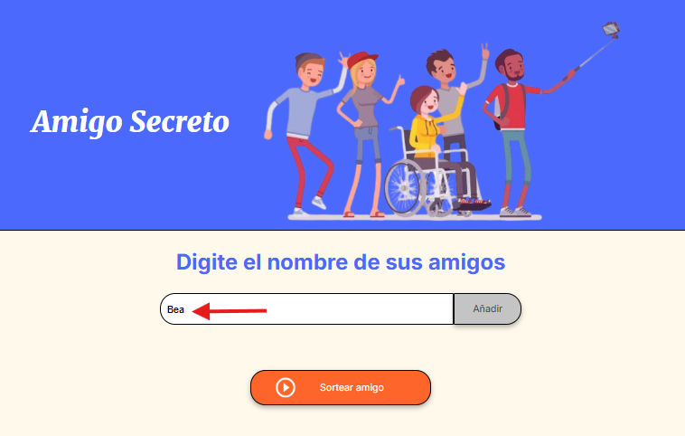

---------------

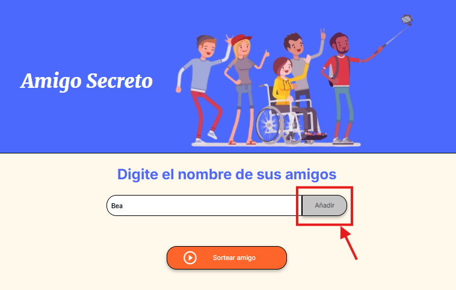

-----------------

- Cada vez que el usuario ingresa un amigo se va generando una lista donde se ven los nombres ya agregados.

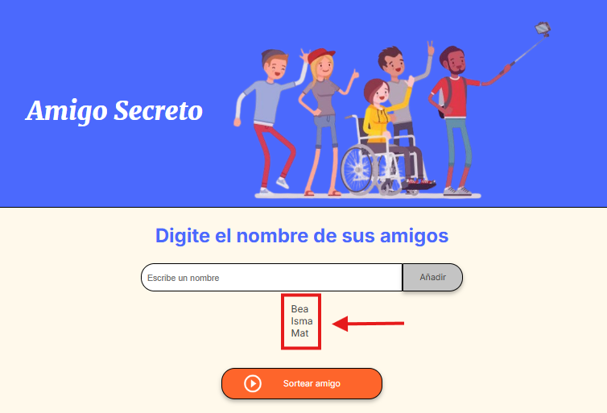

-----------------

Si hay dos o más personas con el mismo nombre deben colocar alguna letra extra que los diferencie (por ejemplo la inicial del apellido) ya que el juego está diseñado para evitar que se repitan nombres y asegurar que el sorteo sea más claro y transparente.

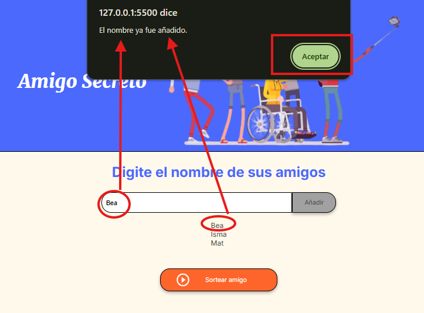

-----------------

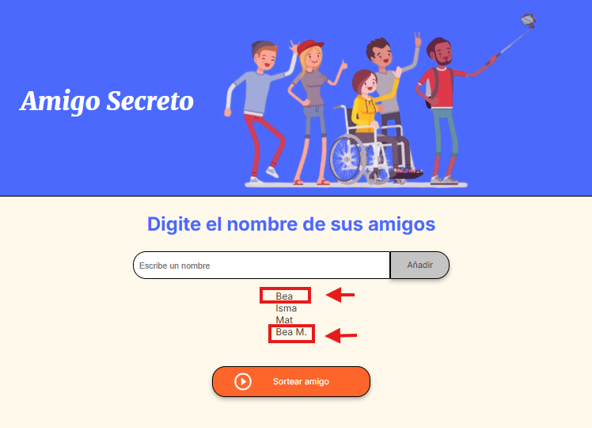

-----------------

 Una vez que se hayan introducido todos los nombres de los participantes, basta con hacer click en el botón **`Sortear amigo`**. Inmediatamente, aparecerá en verde la leyenda 'La amistad secreta es:', seguida del nombre de la persona ganadora.

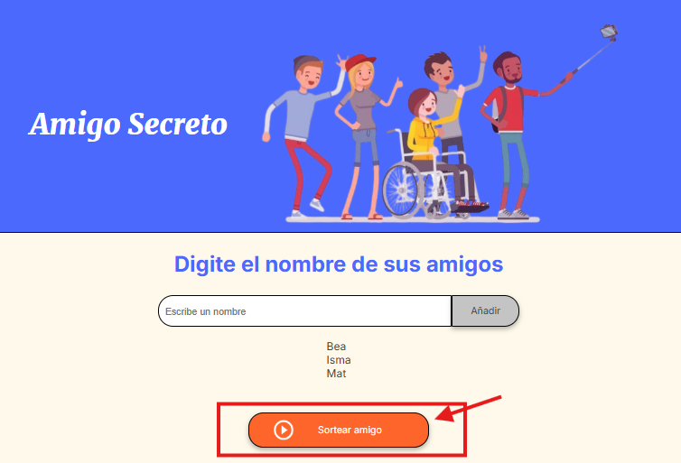

-----------------

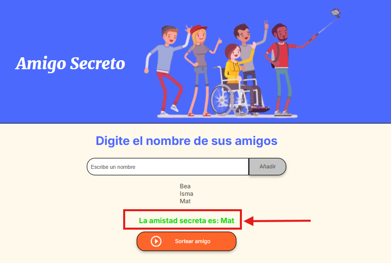

-----------------

## Acceso al proyecto 🛠️

Para ejecutar y/o modificar el proyecto:

1. Descarga los archivos haciendo click en **`Code`** y seleccionando **`Download ZIP`**, realiza la extracción de los archivos y ábrelos en **Visual Studio Code (VSCode)**.

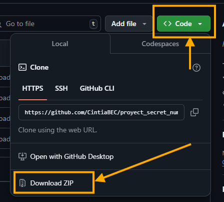

-----------------

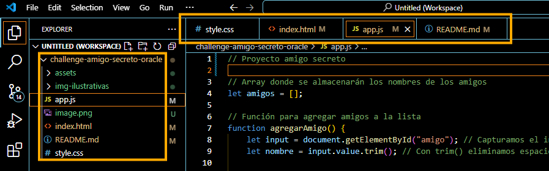

-----------------

2. Para actualizar automáticamente la página al modificar `app.js`, instala la extensión **Live Server** en VSCode como se detalla a continuación: 

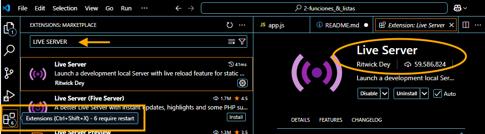

---------------------

Luego abre el archivo `index.html` con ella haciendo click derecho sobre el archivo en el menú del costado izquierdo (como se observa en la imágen) y seleccionando la opción *'Abrir con Live Server'*.

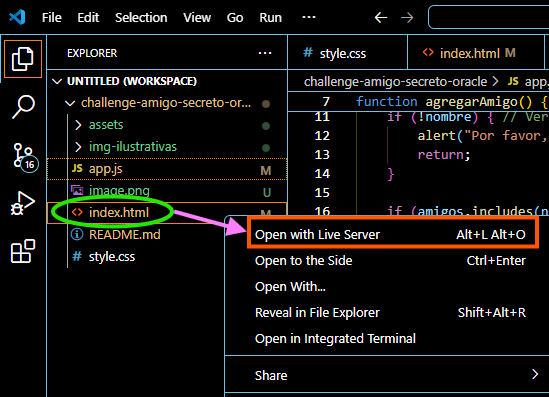

-----------------

## Tecnologías utilizadas 💻

- **JavaScript**
- **css**
- **html**
- **Visual Studio Code (VSCode)**
- **Navegador Google Chrome**

## Material consultado 🖇️
- https://www.w3schools.com/Jsref/jsref_trim_string.asp
- https://stackoverflow.com/questions/6855773/how-to-get-events-associated-with-dom-elements
- https://www.w3schools.com/jsref/dom_obj_event.asp
- https://www.aluracursos.com/blog/guia-de-javascript
- https://www.aluracursos.com/blog/como-utilizar-operadores-de-comparacion-en-javascript
- https://www.aluracursos.com/blog/como-escribir-un-readme-increible-en-tu-github
- https://www.aluracursos.com/blog/como-trabajar-con-markdown
- https://devhints.io/git-log
- https://www.aluracursos.com/blog/github-pages
- https://docs.github.com/es/pages/getting-started-with-github-pages/creating-a-github-pages-site

## Contribuyentes y desarrolladores ✒️

La cátedra, compuesta por los profesores Leonardo Castillo Lacruz, Christian Velasco, Ellen Pimentel, José Darío González Charris y Bárbara Santos, me brindó los archivos base: style.css e index.html. Asimismo, fueron ellos quienes me instruyeron en el uso de tecnologías clave como JavaScript, ChatGPT, Git & GitHub, HTML5 y CSS3. El archivo app.js fue desarrollado y documentado por mí, siguiendo las normativas establecidas para la presentación del trabajo final.

| [ Leonardo Castillo Lacruz](https://github.com/ljcl79) |  [ Christian Velasco](https://github.com/christianpva) | [ Ellen Pimentel](https://github.com/Ellen-code) | [ Jose Dario Gonzalez Charris](https://github.com/JoseDarioGonzalezCha) | [ Bárbara Santos](https://github.com/bacristiane) | [ Cintia B. Enfarrell Crisie](https://github.com/CintiaBEC) |
| :---: | :---: | :---: |:---: |:---: |:---: |

## Agradecimietos ✨

Quiero expresar mi más sincero agradecimiento a los profesores responsables de la formación *'Principiante en Programación G8 - ONE'* por compartir su valioso conocimiento. Gracias a su orientación, pude ampliar mi visión sobre el impacto que las tecnologías actuales tienen en nuestra vida y comprender su importancia en mi desarrollo profesional y personal.

